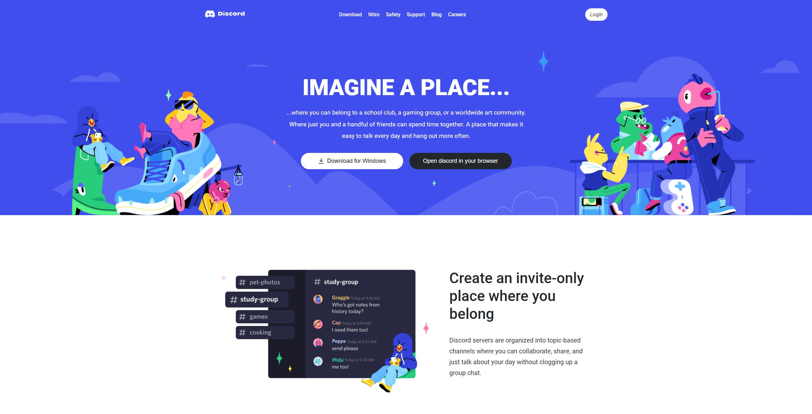
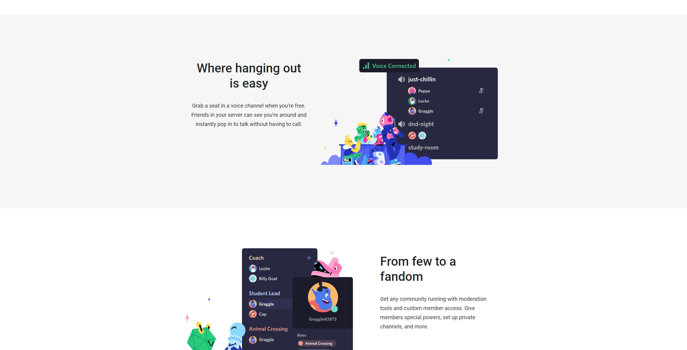
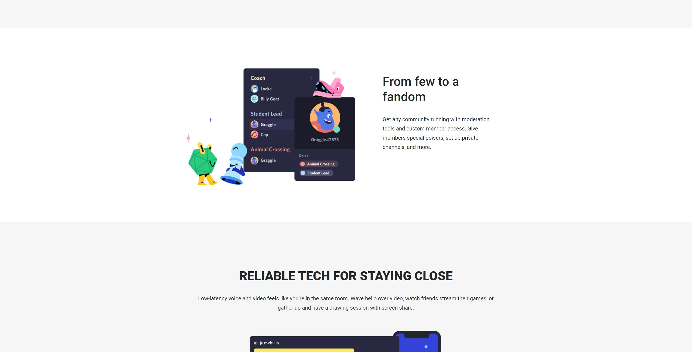
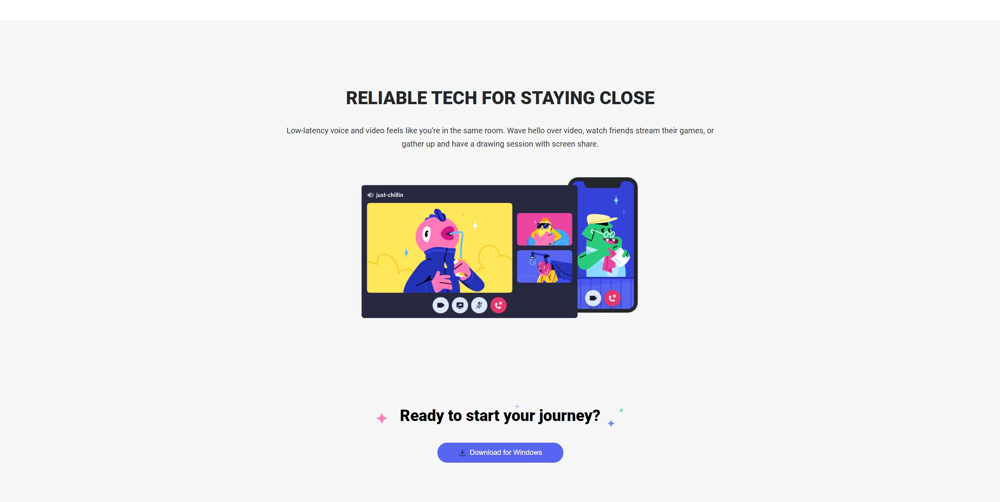
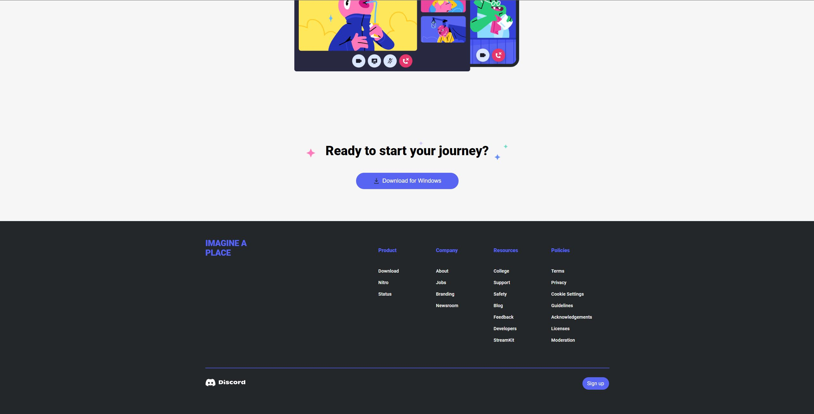

# Discord website CLONE

> This project was ment for react practice alone, working with components aswell as challenging myself in creating a replica of their home page using sass. The clone is yet to be responsive. No live demo is provided because of browser security.

## Table of Contents

- [General Info](#general-information)
- [Technologies Used](#technologies-used)
- [Features](#features)
- [Screenshots](#screenshots)
- [Project Status](#project-status)
- [Room for Improvement](#room-for-improvement)
- [Contact](#contact)

## General Information

- If you want to see the clone in action, download the project and run:
  `npm run start`

- The main focus for the code is to test my skills and improve. I was wondering if I would have the skills to code the design of discords own website. I believe I managed to fully design and code the home page, however my react skills are not yet mastered.

## Technologies Used

- React - version ^18.1.0
- Sass - version ^1.52.2

## Features

- Home page clone of the original discord website
- Looks neat on desktop

## Screenshots

<!-- If you have screenshots you'd like to share, include them here. -->

## Project Status

Project is: _in-progess_ / _complete_ /

- The project is considered finished, as the vast size of the website is to much work for me to complete now by myself. I am happy with the home page being created, however it is not fully responsive. I will move on to smaller projects for now. Might come back at some point to finish the responsiveness of the home page.

## Room for Improvement

Room for improvement:

- Making the home page fully responsive
- Better understanding of components and how to use/reuse them.

To do:

- Make homepage responsive

## Contact

Created by [@eivindsimonsen](https://www.easimonsen.com/) - feel free to contact me!
